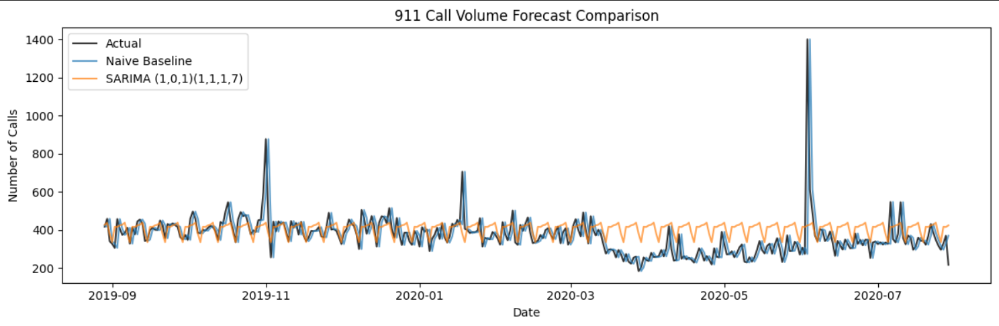

# 🚑 Emergency 911 Call Volume Forecasting  
**Public Safety Demand Forecasting with Time Series Analysis**

---

## Why This Project Matters

Emergency response teams don’t get the luxury of reacting late.  
Police, fire, and medical services need to **anticipate demand** so they can staff appropriately, respond quickly, and avoid being caught off-guard during spikes in emergency calls.

This project focuses on forecasting **daily 911 call volume** using historical emergency call data from the Philadelphia metropolitan area. The goal is **not** to predict exact call counts, but to provide a **decision-support signal** that helps public safety teams plan resources more effectively.

---

## Dataset

- **Source:** Public 911 emergency call data (Montgomery County, PA – Philadelphia metro area)
- **Time span:** Multiple years of daily call records
- **Core fields used:**
  - Call timestamp  
  - Emergency category (used during exploratory analysis)

> Note: Due to GitHub file size limits, the raw CSV dataset is not included in this repository.  
> The dataset is publicly available on Kaggle:  
> https://www.kaggle.com/datasets/mchirico/montcoalert

The raw data reflects real operational conditions, including mixed timestamp formats, missing days, and high variability—requiring careful preprocessing before modeling.

---

## Approach & Methodology

### 1. Exploratory Data Analysis (EDA)
- Aggregated raw call records into daily call volumes
- Identified strong **weekly seasonality**
- Observed moderate **monthly patterns**
- Detected occasional **extreme spikes**, consistent with real emergency events

These findings guided model selection and evaluation strategy.

---

### 2. Feature Engineering
To support baseline comparisons and structured analysis:
- Lag features (1, 7, 14 days)
- Rolling averages (7-day and 14-day windows)
- Calendar features (day of week, weekend indicator)

Feature engineering was kept transparent and deterministic to ensure reproducibility.

---

### 3. Baseline Model
A simple but important benchmark was used:

> **Naive persistence baseline:**  
> Tomorrow’s demand = today’s demand

Despite its simplicity, this baseline performed surprisingly well due to strong short-term autocorrelation in emergency call volume—highlighting why baselines are essential in time-series forecasting.

---

### 4. Time Series Modeling
Seasonal ARIMA (SARIMA) models were applied to explicitly capture:
- Trend
- Weekly seasonality
- Temporal dependence

Two SARIMA configurations were evaluated:
- An initial baseline SARIMA model
- A tuned SARIMA model focused on reducing large forecast errors

All models were evaluated using **time-based train/test splits** to mirror real-world forecasting conditions.

---

## Results & Model Comparison

| Model | MAE | RMSE |
|------|----:|----:|
| Naive Baseline | ~55 | ~103 |
| SARIMA (initial) | ~73 | ~106 |
| SARIMA (tuned) | ~66 | **~101** |

The comparison plot below shows how each model tracks actual call volume over time:

**Key observations:**
- The naive baseline performed best on average error (MAE).
- The tuned SARIMA model reduced large forecast errors (lower RMSE).
- In public safety contexts, **reducing extreme under-forecasting risk** is often more important than minimizing average error.

---

## Business Insights & Operational Impact

### Observed Patterns
- **Weekly behavior:** Higher demand on weekdays, peaking toward the end of the workweek
- **Seasonality:** Elevated call volume during late fall and early winter
- **Volatility:** Occasional spikes that standard averages fail to capture

---

### How This Forecast Would Be Used

This model is not meant to replace dispatcher judgment. Instead, it acts as a **decision-support tool** that could help agencies:

- Establish baseline staffing expectations
- Flag high-risk periods in advance
- Trigger contingency staffing plans
- Pre-position police, fire, and EMS resources
- Reduce operational risk during demand surges

---

## Tools & Technologies

- Python (Pandas, NumPy)
- Time-series modeling with Statsmodels (SARIMA)
- Data visualization with Matplotlib
- Jupyter Notebook
- Git & GitHub

---

## Key Takeaways

- Simple baselines can be difficult to beat in volatile operational time series
- Seasonality-aware models help control large forecast errors
- Model evaluation should align with **real business risk**, not just metrics
- Clear problem framing and honest comparisons matter more than complex models

---

## Future Improvements

- Incorporate weather and holiday effects as exogenous variables
- Extend forecasting to an **hourly level** for shift-based staffing
- Add probabilistic forecasts and prediction intervals
- Explore deployment via dashboards for operational teams
