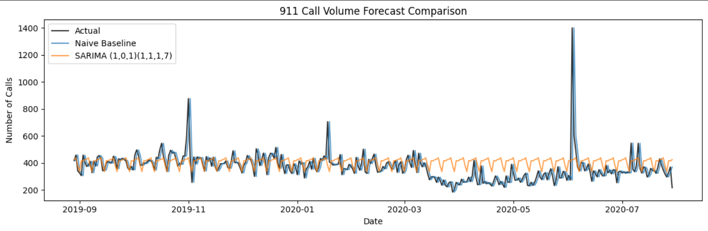

# Emergency 911 Call Volume Forecasting

A time-series forecasting project using historical 911 call data to model daily emergency call demand and support public safety resource planning. Built with SARIMA and baseline comparisons on multi-year real-world data from Montgomery County, PA.

---

## Problem Context

Emergency response teams plan staffing and resources ahead of time with limited visibility into future demand. This project evaluates whether seasonality-aware forecasting models can provide a reliable planning signal — especially during high-demand periods where under-staffing has the highest cost.

---

## What I Did

- Aggregated raw 911 call records into daily volumes and handled mixed timestamp formats, missing days, and high variability
- Built lag features (1, 7, 14 days), rolling averages, and calendar features (day of week, weekend indicator)
- Established a naive persistence baseline before adding model complexity
- Evaluated two SARIMA configurations using time-based train/test splits to mirror real-world forecasting conditions
- Chose RMSE as the primary metric — in public safety, large under-forecasting errors matter more than average error

---

## Results

In operational forecasting, **reducing extreme errors matters more than minimizing average error**. A staffing shortfall during a demand spike is far costlier than a small daily miscalculation — so RMSE is the metric that counts here.

| Model | MAE | RMSE |
|---|---|---|
| Naive Baseline | ~55 | ~103 |
| SARIMA (initial) | ~73 | ~106 |
| SARIMA (tuned) | ~66 | **~101** |

The tuned SARIMA model achieved the lowest RMSE — reducing the largest forecast errors compared to both the naive baseline and initial SARIMA. The naive baseline won on MAE due to strong short-term autocorrelation, which is expected and consistent with time-series literature.

---

## Key Patterns Found

- Higher call volume on weekdays, especially later in the week
- Elevated demand during late fall and early winter
- Occasional spikes that rolling averages consistently fail to capture — flagging the need for probabilistic intervals in production

---

## Key Takeaways

- Always establish a strong baseline before claiming a model adds value
- Metric choice should reflect business risk, not just statistical convention
- Seasonality-aware models reduce tail risk even when average error looks similar
- Honest evaluation — including cases where simpler models win — builds more trustworthy analysis

---

## Tech Stack

| Area | Tools |
|---|---|
| Modeling | SARIMA, statsmodels |
| Data Processing | Python, Pandas, NumPy |
| Visualization | Matplotlib |
| Dev | Jupyter, VS Code, Git |

---

## Data

- **Source:** Public 911 call data — Montgomery County, PA (Philadelphia metro area)
- **Dataset:** [Kaggle — montcoalert](https://www.kaggle.com/datasets/mchirico/montcoalert)
- **Time span:** Multiple years of daily call records
- Raw data not included due to file size — download directly from Kaggle

---

## Future Improvements

- Add weather and holiday data as exogenous variables
- Extend to hourly forecasting for shift-based staffing decisions
- Add prediction intervals for probabilistic staffing recommendations
- Deploy as an operational dashboard for planning teams

---

## Author

**Sanjay Kandimalla**
MS in Applied Statistics & Data Science — University of Texas at Arlington (Dec 2025)
Open to full-time Data Analyst and Data Scientist roles · No sponsorship required · Open to relocation

- 🔗 [LinkedIn](https://www.linkedin.com/in/sanjay-kandimalla/)
- 💻 [GitHub](https://github.com/Sanjay-Kandimalla)
- 📧 sanjay.kandimalla2025@gmail.com
